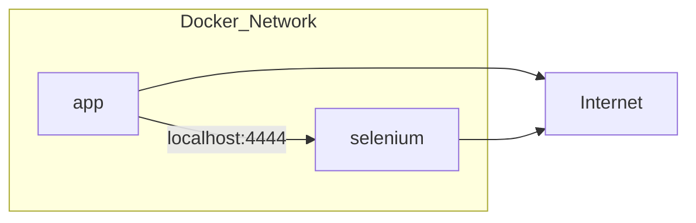
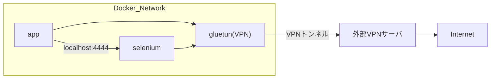

# sample_docker-vpn

このリポジトリは、Docker Composeを用いてVPN経由でアクセスを行うサンプルです。


## 概要
複数のDockerコンテナ（アプリケーション、Selenium、VPN）を連携させ、VPN経由でWebアクセスを実現します。


## コンテナ構成
- **app**: Pythonアプリケーション（例: requestsやSeleniumでWebアクセス）
- **selenium**: Selenium Standalone（Chrome）
- **gluetun**: VPN接続用コンテナ（OpenVPN）
- autoheal: ヘルスチェック失敗時に自動再起動するユーティリティ


## 事前準備

1. **VPN設定ファイルの取得**  
   [VPN Gate](https://www.vpngate.net/ja/) からOpenVPN設定ファイル（`.ovpn`）をダウンロードしてください。  
   スコアが高く、Pingが低いサーバーを選ぶのがおすすめです。  
   ※ **IPアドレスが埋め込まれている.ovpnファイル**を選択してください（gluetunはDDNSでの接続をサポートしていません）。

2. **VPN設定ファイルの配置**  
   ダウンロードした`.ovpn`ファイルを `gluetun/openvpn/myvpn.ovpn` にリネームして配置します。
   ```sh
   cp /path/to/downloaded/vpngate_*.ovpn ./gluetun/openvpn/myvpn.ovpn
   ```

**注意事項**
- VPN Gateのサーバーは定期的に変更されるため、接続できない場合は別のサーバーの設定ファイルを試してください。


## VPNを利用しない接続サンプル

VPN を使わず、通常のネットワーク経由で外部サイトにアクセスした場合の挙動例です。



### 実行例
```sh
$ docker compose -f docker-compose.yml up --build
...
app-1       | [Selenium] Your IP address is: 203.0.113.10
app-1       | [Requests] Your IP address is: 203.0.113.10
# 203.0.113.10 は例です
```

Selenium経由・requests経由ともにホストのグローバルIPアドレスが表示されます。\
VPNを使わない場合、全ての通信は通常のネットワーク経由となります。

## VPN接続サンプル

VPN を利用し、VPN経由で外部サイトにアクセスした場合の挙動例です。



### 実行例
```sh
$ docker compose -f docker-compose.yml -f docker-compose.gluetun.yml up --build
...
app-1       | [Selenium] Your IP address is: 219.100.37.170
app-1       | [Requests] Your IP address is: 219.100.37.170
# 219.100.37.170 は例です
```

Selenium経由・requests経由ともにVPNで割り当てられたグローバルIPアドレスが表示されます。\
VPNを使うことで、通信経路がVPNトンネルに切り替わることを確認できます。


## 想定ユースケース
- VPN経由でのWebスクレイピングや自動テスト
- Seleniumを使ったブラウザ操作のVPNトンネリング
